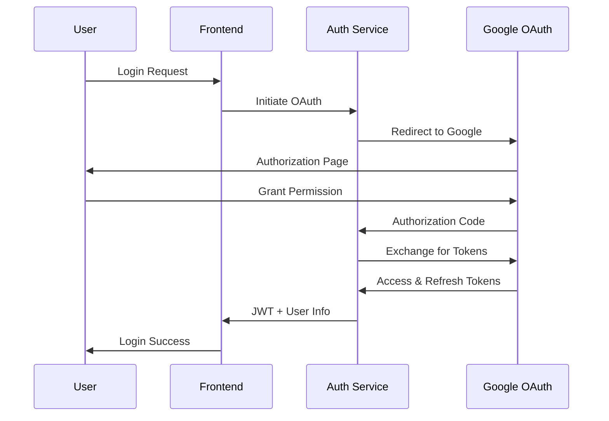
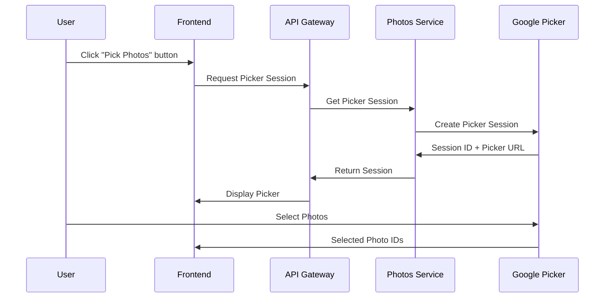
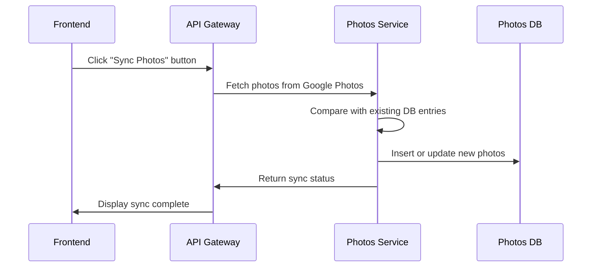
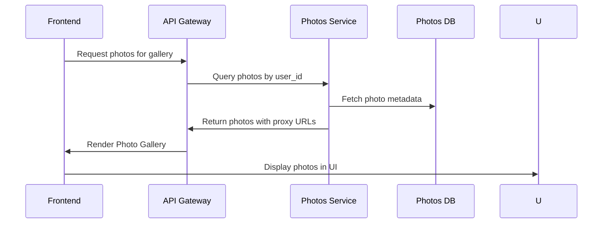
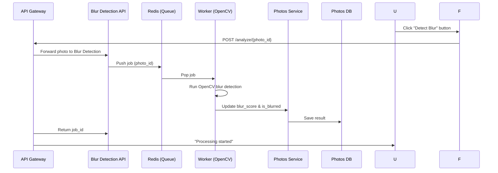

# Classify Service Design and Specifications

## 1. Project Overview

### 1.1 Service Overview
- **Service Name**: Classify
- **Purpose**: Automatically categorize Google Photos images based on camera shake presence to support efficient image management
- **Target Users**: General users utilizing Google Photos

### 1.2 Key Features
- Login via Google OAuth authentication
- Integration with Google Photos Library API
- Image blur detection
- Categorized image display (All/Blurred/Not Blurred)
- User-configurable blur detection threshold

## 2. System Architecture

### 2.1 Architecture Overview
```
┌─────────────────┐    ┌──────────────────┐    ┌─────────────────┐
│   Frontend      │    │   API Gateway    │    │  Microservices  │
│  (Next.js)      │<-->│   (Rest  API)    │<-->│   (Python)      │
└─────────────────┘    └──────────────────┘    └─────────────────┘
                                                       │
┌─────────────────┐    ┌──────────────────┐            │
│   PostgreSQL    │<-->│   Redis Cache    │<───────────┘
└─────────────────┘    └──────────────────┘

```

2.2 Technology Stack
- **Frontend**: React 18 + Next.js 14
- **Backend**: Python 3.11 + FastAPI
- **Database**: PostgreSQL 15
- **Cache**: Redis 7
- **API**: GraphQL (Strawberry)
- **Container**: Docker + Docker Compose
- **Orchestration**: Kubernetes (EKS)
- **Cloud**: AWS

2.3 Microservices Architecture
1. **auth-service**: Manages OAuth authentication
2. **photos-service**: Google Photos API integration
3. **blur-detection-service**: Handshake/Blur detection processing
4. **api-gateway**: Unified REST API endpoint
5. **frontend**: React/Next.js application
7. **redis**: In-memory cache
8. **auth-service-db (PostgreSQL databases)**: Dedicated DB instances for auth-service
9. **photos-service-db (PostgreSQL databases)**: Dedicated DB instances for photos-service

## 3. Database Design

### 3.1 ER Diagram
```
Users (1) ──── (N) Photos
  │
  │ (1)
  │
  │ (1)
OAuthToken
```

### 3.2 Table Definitions

#### 3.2.1 users Table
```sql
CREATE TABLE users (
    id UUID PRIMARY KEY DEFAULT gen_random_uuid(),
    google_id VARCHAR(255) UNIQUE NOT NULL,
    email VARCHAR(255) NOT NULL,
    name VARCHAR(255),
    profile_picture_url TEXT,
    created_at TIMESTAMP WITH TIME ZONE DEFAULT CURRENT_TIMESTAMP,
    updated_at TIMESTAMP WITH TIME ZONE DEFAULT CURRENT_TIMESTAMP,
    last_login_at TIMESTAMP WITH TIME ZONE
);

CREATE INDEX idx_users_google_id ON users(google_id);
CREATE INDEX idx_users_email ON users(email);
```

#### 3.2.2 photos Table
```sql
CREATE TABLE photos (
    id UUID PRIMARY KEY DEFAULT gen_random_uuid(),
    user_id UUID NOT NULL REFERENCES users(id) ON DELETE CASCADE,
    google_photo_id VARCHAR(255) UNIQUE NOT NULL,
    filename VARCHAR(500),
    media_type VARCHAR(50) DEFAULT 'IMAGE',
    blur_score DECIMAL(5,4), -- 0.0000-1.0000の手ブレスコア
    is_blurred BOOLEAN,
    processed_at TIMESTAMP WITH TIME ZONE,
    google_created_time TIMESTAMP WITH TIME ZONE,
    width INTEGER,
    height INTEGER,
    file_size BIGINT,
    mime_type VARCHAR(100),
    created_at TIMESTAMP WITH TIME ZONE DEFAULT CURRENT_TIMESTAMP,
    updated_at TIMESTAMP WITH TIME ZONE DEFAULT CURRENT_TIMESTAMP
);

CREATE INDEX idx_photos_user_id ON photos(user_id);
CREATE INDEX idx_photos_google_photo_id ON photos(google_photo_id);
CREATE INDEX idx_photos_user_blur ON photos(user_id, is_blurred);
CREATE INDEX idx_photos_processed ON photos(processed_at) WHERE processed_at IS NULL;
```

#### 3.2.3 oauth_tokens Table
```sql
CREATE TABLE oauth_tokens (
    user_id UUID PRIMARY KEY REFERENCES users(id) ON DELETE CASCADE,
    access_token TEXT NOT NULL,
    refresh_token TEXT NOT NULL,
    token_expires_at TIMESTAMP WITH TIME ZONE NOT NULL,
    scope TEXT NOT NULL,
    created_at TIMESTAMP WITH TIME ZONE DEFAULT CURRENT_TIMESTAMP,
    updated_at TIMESTAMP WITH TIME ZONE DEFAULT CURRENT_TIMESTAMP
);
```

#### 3.2.4 Database Separation

In this system, I maintain separate PostgreSQL databases for authentication and photos management:
This separation improves security, simplifies backups, and allows each service to scale independently.

- **auth-db**: Stores `users` and `oauth_tokens` tables
  - Manages user accounts, login sessions, and OAuth tokens
  - Ensures sensitive authentication data is isolated from photo data

- **photos-db**: Stores `photos` table
  - Contains all photo metadata, blur detection results, and media attributes
  - Linked to `auth-db` via `user_id` foreign key references for relational integrity

## 4. API Design (WIP)

### 4.1 REST API Endpoint (WIP)

#### 4.1.1 Auth Service
```
POST /tokens/google # Obtain OAuth token for Google account
POST /tokens/refresh # Refresh existing OAuth token
GET /tokens/verify # Verify validity of access token
```

#### 4.1.2 Photos Service
```
GET /sessions/{user_id} # Create or retrieve a Google Photos Picker session
GET /mediaItems/{user_id}?sessionId={session_id} # Fetch media items from Google Photos
GET /photos/{user_id} # Retrieve synced photos from database
PATCH /photos/{photo_id} # Update photo metadata (blur_score, is_blurred, etc.)
```

#### 4.1.3 Blur Detection Service
```
POST /analyze/{photo_id}?user_id={user_id} # Analyze single photo for blur
POST /analyze/batch # Batch blur detection (optional)
GET /status/{job_id} # Check status of ongoing analysis job
```

## 5. Detailed Design

### 5.1 Authentication Flow


### 5.2 Google Photo Picker Flow


### 5.3 Photo Sync Flow


### 5.4 Photo Display Flow


### 5.5 Photo Analyze Flow


## 6. Infrastructure

### 6.1 Kubernetes Design (WIP)

#### 6.1.1 Namespace settings

#### 6.1.2 ConfigMap

#### 6.1.3 Deployment（API Gateway）


### 6.2 AWS Resource Configuration

#### 6.2.1 EKS settings

#### 6.2.2 RDS settings

