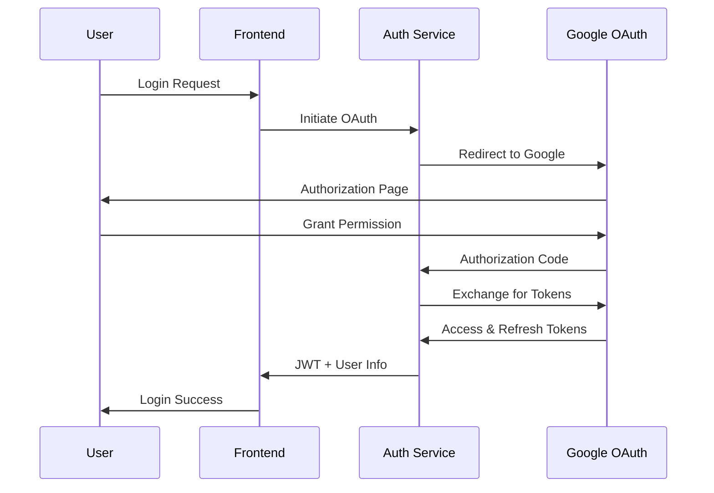
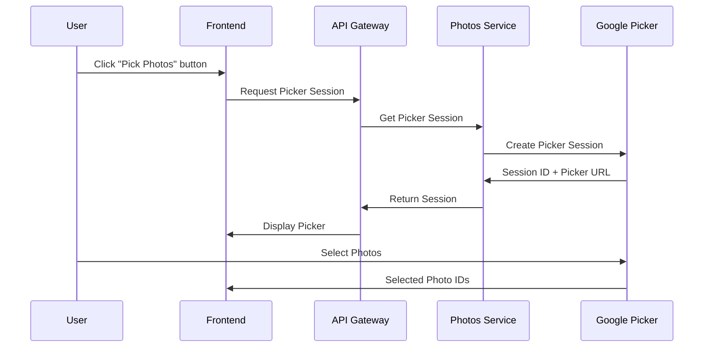
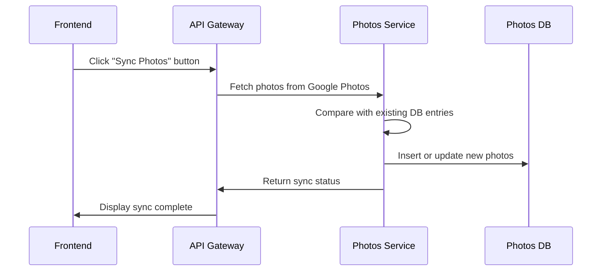
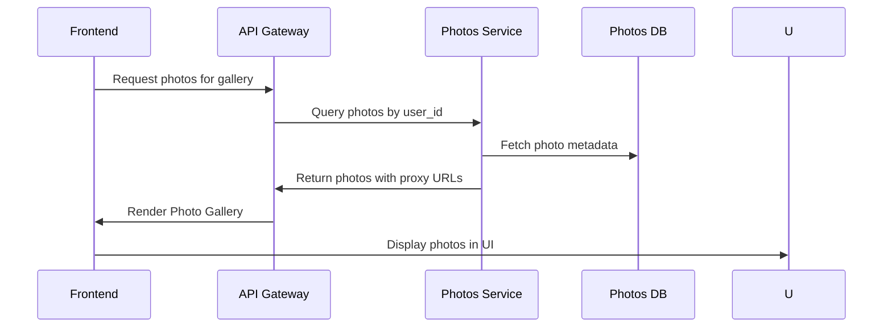
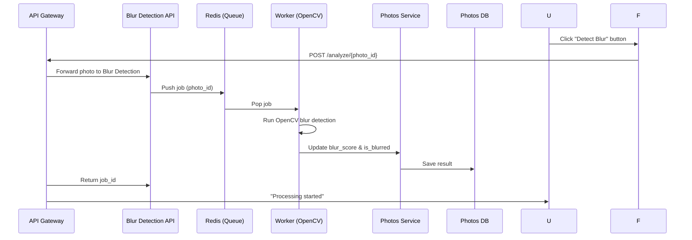

# Classify Service Design and Specifications

## 1. Project Overview

### 1.1 Service Overview
- **Service Name**: Classify
- **Purpose**: Automatically categorize Google Photos images based on camera shake presence to support efficient image management
- **Target Users**: General users utilizing Google Photos

### 1.2 Key Features
- Login via Google OAuth authentication
- Integration with Google Photos Library API
- Image blur detection
- Categorized image display (All/Blurred/Not Blurred)
- User-configurable blur detection threshold

## 2. System Architecture

### 2.1 Architecture Overview
```
┌─────────────────┐    ┌──────────────────┐    ┌─────────────────┐
│   Frontend      │    │   API Gateway    │    │  Microservices  │
│  (Next.js)      │<-->│   (Rest  API)    │<-->│   (Python)      │
└─────────────────┘    └──────────────────┘    └─────────────────┘
                                                       │
┌─────────────────┐    ┌──────────────────┐            │
│   PostgreSQL    │<-->│   Redis Cache    │<───────────┘
└─────────────────┘    └──────────────────┘

```

2.2 Technology Stack
- **Frontend**: React 18 + Next.js 14
- **Backend**: Python 3.11 + FastAPI
- **Database**: PostgreSQL 15
- **Cache**: Redis 7
- **API**: GraphQL (Strawberry)
- **Container**: Docker + Docker Compose
- **Orchestration**: Kubernetes (EKS)
- **Cloud**: AWS

2.3 Microservices Architecture
1. **auth-service**: Manages OAuth authentication
2. **photos-service**: Google Photos API integration
3. **blur-detection-service**: Handshake/Blur detection processing
4. **api-gateway**: Unified REST API endpoint
5. **frontend**: React/Next.js application
7. **redis**: In-memory cache
8. **auth-service-db (PostgreSQL databases)**: Dedicated DB instances for auth-service
9. **photos-service-db (PostgreSQL databases)**: Dedicated DB instances for photos-service

## 3. Database Design

### 3.1 ER Diagram
```
Users (1) ──── (N) Photos
  │
  │ (1)
  │
  │ (1)
OAuthToken
```

### 3.2 Table Definitions

#### 3.2.1 users Table
```sql
CREATE TABLE users (
    id UUID PRIMARY KEY DEFAULT gen_random_uuid(),
    google_id VARCHAR(255) UNIQUE NOT NULL,
    email VARCHAR(255) NOT NULL,
    name VARCHAR(255),
    profile_picture_url TEXT,
    created_at TIMESTAMP WITH TIME ZONE DEFAULT CURRENT_TIMESTAMP,
    updated_at TIMESTAMP WITH TIME ZONE DEFAULT CURRENT_TIMESTAMP,
    last_login_at TIMESTAMP WITH TIME ZONE
);

CREATE INDEX idx_users_google_id ON users(google_id);
CREATE INDEX idx_users_email ON users(email);
```

#### 3.2.2 photos Table
```sql
CREATE TABLE photos (
    id UUID PRIMARY KEY DEFAULT gen_random_uuid(),
    user_id UUID NOT NULL REFERENCES users(id) ON DELETE CASCADE,
    google_photo_id VARCHAR(255) UNIQUE NOT NULL,
    filename VARCHAR(500),
    media_type VARCHAR(50) DEFAULT 'IMAGE',
    blur_score DECIMAL(5,4), -- 0.0000-1.0000の手ブレスコア
    is_blurred BOOLEAN,
    processed_at TIMESTAMP WITH TIME ZONE,
    google_created_time TIMESTAMP WITH TIME ZONE,
    width INTEGER,
    height INTEGER,
    file_size BIGINT,
    mime_type VARCHAR(100),
    created_at TIMESTAMP WITH TIME ZONE DEFAULT CURRENT_TIMESTAMP,
    updated_at TIMESTAMP WITH TIME ZONE DEFAULT CURRENT_TIMESTAMP
);

CREATE INDEX idx_photos_user_id ON photos(user_id);
CREATE INDEX idx_photos_google_photo_id ON photos(google_photo_id);
CREATE INDEX idx_photos_user_blur ON photos(user_id, is_blurred);
CREATE INDEX idx_photos_processed ON photos(processed_at) WHERE processed_at IS NULL;
```

#### 3.2.3 oauth_tokens Table
```sql
CREATE TABLE oauth_tokens (
    user_id UUID PRIMARY KEY REFERENCES users(id) ON DELETE CASCADE,
    access_token TEXT NOT NULL,
    refresh_token TEXT NOT NULL,
    token_expires_at TIMESTAMP WITH TIME ZONE NOT NULL,
    scope TEXT NOT NULL,
    created_at TIMESTAMP WITH TIME ZONE DEFAULT CURRENT_TIMESTAMP,
    updated_at TIMESTAMP WITH TIME ZONE DEFAULT CURRENT_TIMESTAMP
);
```

#### 3.2.4 Database Separation

In this system, I maintain separate PostgreSQL databases for authentication and photos management:
This separation improves security, simplifies backups, and allows each service to scale independently.

- **auth-db**: Stores `users` and `oauth_tokens` tables
  - Manages user accounts, login sessions, and OAuth tokens
  - Ensures sensitive authentication data is isolated from photo data

- **photos-db**: Stores `photos` table
  - Contains all photo metadata, blur detection results, and media attributes
  - Linked to `auth-db` via `user_id` foreign key references for relational integrity

## 4. API Design (WIP)

### 4.1 REST API Endpoint (WIP)

#### 4.1.1 Auth Service
```
POST /tokens/google # Obtain OAuth token for Google account
POST /tokens/refresh # Refresh existing OAuth token
GET /tokens/verify # Verify validity of access token
```

#### 4.1.2 Photos Service
```
GET /sessions/{user_id} # Create or retrieve a Google Photos Picker session
GET /mediaItems/{user_id}?sessionId={session_id} # Fetch media items from Google Photos
GET /photos/{user_id} # Retrieve synced photos from database
PATCH /photos/{photo_id} # Update photo metadata (blur_score, is_blurred, etc.)
```

#### 4.1.3 Blur Detection Service
```
POST /analyze/{photo_id}?user_id={user_id} # Analyze single photo for blur
POST /analyze/batch # Batch blur detection (optional)
GET /status/{job_id} # Check status of ongoing analysis job
```

## 5. Detailed Design

### 5.1 Authentication Flow


### 5.2 Google Photo Picker Flow


### 5.3 Photo Sync Flow


### 5.4 Photo Display Flow


### 5.5 Photo Analyze Flow


## 6. Infrastructure

### 6.1 Development Environment (Docker Compose)

#### 6.1.1 Services Configuration

The development environment uses Docker Compose with the following services:

- **frontend** (Port 3000): Next.js application
- **api-gateway** (Port 8000): GraphQL API Gateway
- **auth-service** (Port 8001): OAuth authentication service
- **photos-service** (Port 8002): Google Photos integration service
- **blur-detection-service** (Port 8003): Blur analysis API
- **blur-worker**: Background worker for blur detection jobs
- **auth-service-db** (Port 5434): PostgreSQL for auth-service
- **photos-service-db** (Port 5435): PostgreSQL for photos-service
- **redis** (Port 6379): Redis for task queue and caching

#### 6.1.2 Starting Development Environment

```bash
# Start all services
docker-compose up --build

# Start specific services
docker-compose up frontend api-gateway auth-service

# Stop all services
docker-compose down

# Reset databases (remove volumes)
docker-compose down -v
```

#### 6.1.3 Database Initialization

Databases are automatically initialized via `init.sql` files mounted in docker-compose:
- `backend/auth-service/init.sql`: Creates `users` and `oauth_tokens` tables
- `backend/photos-service/init.sql`: Creates `photos` table

---

### 6.2 Production Environment (Kubernetes on AWS EKS)

#### 6.2.1 Kubernetes Architecture

##### Namespace
- **classify**: Dedicated namespace for all application resources

##### ConfigMap (`01-configmap.yaml`)
```yaml
data:
  AUTH_SERVICE_URL: "http://auth-service:8000"
  PHOTOS_SERVICE_URL: "http://photos-service:8000"
  BLUR_DETECTION_SERVICE_URL: "http://blur-detection-service:8000"
  REDIS_HOST: "<ElastiCache endpoint>"
  REDIS_PORT: "6379"
  LOG_LEVEL: "info"
  ENVIRONMENT: "production"
```

##### Secrets (`02-secrets-template.yaml`)
```yaml
stringData:
  AUTH_DB_URL: "postgresql://auth_service:<password>@<endpoint>/auth_service"
  PHOTOS_DB_URL: "postgresql://photos_service:<password>@<endpoint>/photos_service"
  GOOGLE_CLIENT_ID: "<client_id>"
  GOOGLE_CLIENT_SECRET: "<client_secret>"
  NEXTAUTH_SECRET: "<nextauth_secret>"
```

##### Deployments and Services

| Service | Replicas | Resources (Request/Limit) | Port |
|---------|----------|--------------------------|------|
| api-gateway | 2 | 256Mi/512Mi, 100m/500m | 8000 |
| auth-service | 2 | 256Mi/512Mi, 100m/500m | 8000 |
| photos-service | 2 | 256Mi/512Mi, 100m/500m | 8000 |
| blur-detection-service | 2 | 512Mi/1Gi, 200m/1000m | 8000 |
| blur-worker | 1 | 512Mi/1Gi, 200m/1000m | N/A |

**Health Checks:**
- Liveness Probe: `/health` endpoint
- Readiness Probe: `/health` endpoint

**Service Type:** ClusterIP (internal communication)

##### Ingress (`08-ingress.yaml`)
- **Type**: AWS Application Load Balancer (ALB)
- **Annotations**: Configured for AWS Load Balancer Controller
- **Routes**: Exposes frontend and API gateway to external traffic

#### 6.2.2 AWS Resources (Terraform)

##### VPC Configuration
```
VPC CIDR: 10.0.0.0/16
Public Subnets: 10.0.101.0/24, 10.0.102.0/24 (2 AZs)
Private Subnets: 10.0.1.0/24, 10.0.2.0/24 (2 AZs)
NAT Gateway: 1 (single_nat_gateway for cost optimization)
Internet Gateway: 1
```

##### EKS Cluster
```
Cluster Version: 1.28
Node Group:
  - Instance Type: t3.small
  - Min Size: 2
  - Max Size: 4
  - Desired Size: 2
  - Capacity Type: ON_DEMAND
  - Disk Size: 20GB
IRSA: Enabled
Public Access: Enabled
```

##### RDS PostgreSQL Instances
```
Auth Service DB:
  - Instance Class: db.t3.micro
  - Allocated Storage: 20GB
  - Engine Version: PostgreSQL 15.4
  - Multi-AZ: Disabled (dev), Enabled (prod)
  - Backup Retention: 7 days

Photos Service DB:
  - Instance Class: db.t3.micro
  - Allocated Storage: 20GB
  - Engine Version: PostgreSQL 15.4
  - Multi-AZ: Disabled (dev), Enabled (prod)
  - Backup Retention: 7 days
```

##### ElastiCache Redis
```
Engine: Redis 7.0
Node Type: cache.t3.micro
Number of Nodes: 1
Snapshot Retention: 5 days
```

##### ECR Repositories
```
- classify-api-gateway
- classify-auth-service
- classify-photos-service
- classify-blur-detection-service
- classify-blur-worker

Lifecycle Policy: Keep last 10 images
Image Scanning: Enabled on push
```

##### Security Groups
```
RDS Security Group:
  - Ingress: Port 5432 from EKS nodes

Redis Security Group:
  - Ingress: Port 6379 from EKS nodes
```

#### 6.2.3 Deployment Steps

1. **Deploy Infrastructure with Terraform**
   ```bash
   cd terraform
   terraform init
   terraform plan
   terraform apply
   ```

2. **Configure kubectl**
   ```bash
   aws eks update-kubeconfig --name classify-cluster --region ap-northeast-1
   ```

3. **Create Kubernetes Secrets**
   ```bash
   cd ../k8s
   cp 02-secrets-template.yaml 02-secrets.yaml
   # Edit 02-secrets.yaml with actual values from Terraform outputs
   ```

4. **Deploy Kubernetes Resources**
   ```bash
   kubectl apply -f k8s/00-namespace.yaml
   kubectl apply -f k8s/01-configmap.yaml
   kubectl apply -f k8s/02-secrets.yaml
   kubectl apply -f k8s/03-api-gateway.yaml
   kubectl apply -f k8s/04-auth-service.yaml
   kubectl apply -f k8s/05-photos-service.yaml
   kubectl apply -f k8s/06-blur-detection-service.yaml
   kubectl apply -f k8s/07-blur-worker.yaml
   kubectl apply -f k8s/08-ingress.yaml
   ```

5. **Verify Deployment**
   ```bash
   kubectl get pods -n classify
   kubectl get svc -n classify
   kubectl get ingress -n classify
   ```

---

## 7. Development Workflow

### 7.1 Local Development

1. **Start Backend Services**
   ```bash
   docker-compose up -d auth-service-db photos-service-db redis
   cd backend/auth-service && python main.py
   cd backend/photos-service && python main.py
   cd backend/blur-detection-service && python main.py
   cd backend/blur-detection-service && python worker.py
   ```

2. **Start Frontend**
   ```bash
   cd frontend
   npm install
   npm run dev
   ```

3. **Access Application**
   - Frontend: http://localhost:3000
   - API Gateway: http://localhost:8000/graphql
   - Auth Service: http://localhost:8001
   - Photos Service: http://localhost:8002

### 7.2 Database Management

**Connect to Auth Service Database:**
```bash
docker exec -it classify_auth_service_db psql -U auth_service -d auth_service
```

**Connect to Photos Service Database:**
```bash
docker exec -it classify_photos_service_db psql -U photos_service -d photos_service
```

### 7.3 Building and Pushing Docker Images

```bash
# Login to ECR
aws ecr get-login-password --region ap-northeast-1 | docker login --username AWS --password-stdin <account_id>.dkr.ecr.ap-northeast-1.amazonaws.com

# Build and push images
cd backend/api-gateway
docker build -t classify-api-gateway:latest .
docker tag classify-api-gateway:latest <ecr_registry>/classify-api-gateway:latest
docker push <ecr_registry>/classify-api-gateway:latest

# Repeat for other services
```

---

## 8. Monitoring and Maintenance

### 8.1 Health Checks

All services expose a `/health` endpoint for health monitoring:
```bash
curl http://localhost:8001/health  # Auth Service
curl http://localhost:8002/health  # Photos Service
curl http://localhost:8003/health  # Blur Detection Service
```

### 8.2 Logging

**Development:**
```bash
docker-compose logs -f <service_name>
```

**Production:**
```bash
kubectl logs -n classify -l app=api-gateway --tail=100 -f
kubectl logs -n classify -l app=auth-service --tail=100 -f
```

### 8.3 Scaling

**Kubernetes:**
```bash
kubectl scale deployment/api-gateway -n classify --replicas=3
```

**Horizontal Pod Autoscaler (HPA):**
```bash
kubectl autoscale deployment api-gateway -n classify --cpu-percent=70 --min=2 --max=10
```
