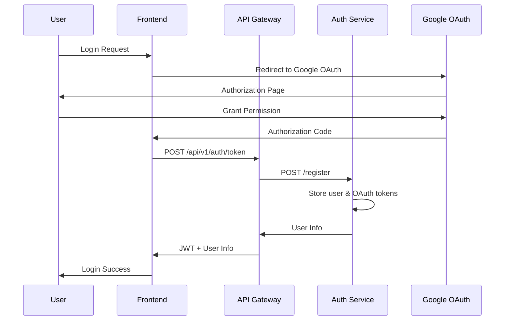
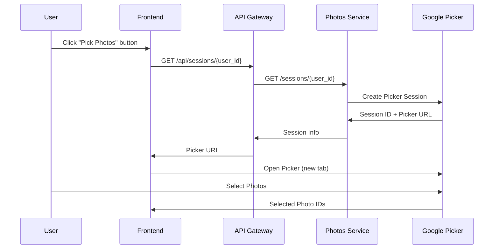
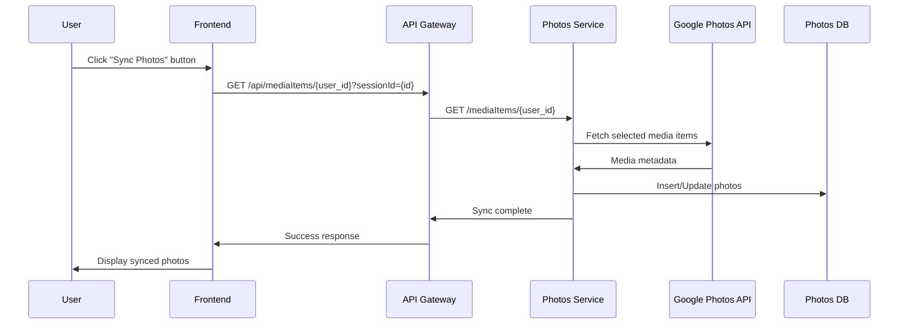
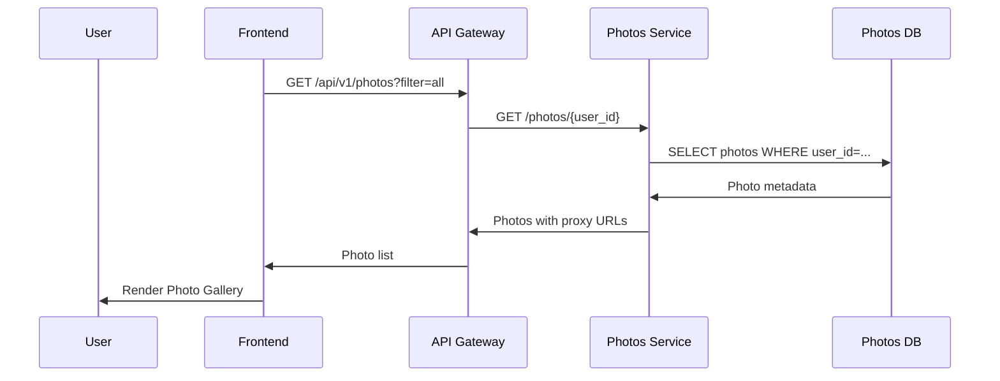
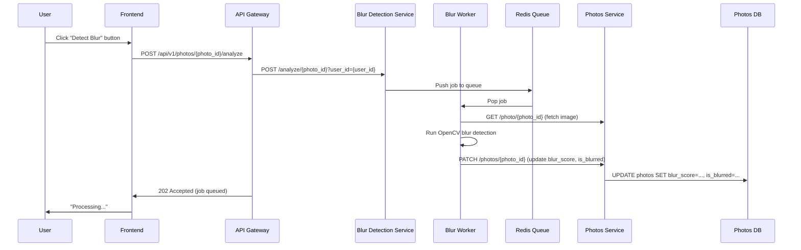
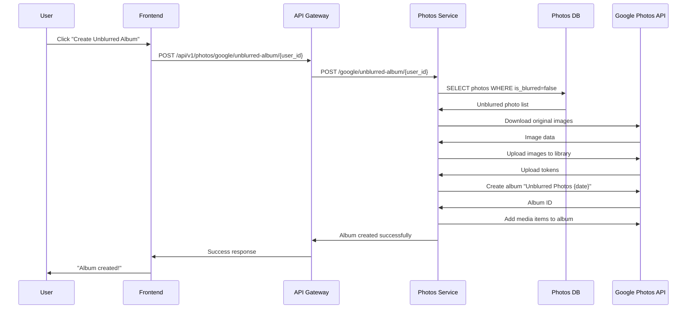

# Classify Service Design and Specifications

## 1. Project Overview

### 1.1 Service Overview
- **Service Name**: Classify
- **Purpose**: Automatically categorize Google Photos images based on camera shake presence to support efficient image management
- **Target Users**: General users utilizing Google Photos
- **Production URL**: https://classify-app.com/

### 1.2 Key Features
- Login via Google OAuth authentication
- Integration with Google Photos Library API and Photos Picker API
- Image blur detection using OpenCV
- AI-powered photo tagging using OpenAI's vision model (gpt-4o-mini)
- Categorized image display (All/Blurred/Not Blurred/Unprocessed)
- User-configurable blur detection threshold
- Automatic album creation with unblurred photos
- Batch blur detection processing
- Real-time system health monitoring

## 2. System Architecture

### 2.1 Architecture Overview
```
┌─────────────────┐    ┌──────────────────┐    ┌─────────────────┐
│   Frontend      │    │   API Gateway    │    │  Microservices  │
│  (Next.js)      │<-->│   (REST API)     │<-->│   (Python)      │
└─────────────────┘    └──────────────────┘    └─────────────────┘
                                                       │
┌─────────────────┐    ┌──────────────────┐            │
│   PostgreSQL    │<-->│   Redis Cache    │<───────────┘
│  (Auth + Photos)│    │   + Task Queue   │
└─────────────────┘    └──────────────────┘

```

### 2.2 Technology Stack
- **Frontend**: React 19 + Next.js 15 (TypeScript, Tailwind CSS)
- **Backend**: Python 3.11 + FastAPI
- **Database**: PostgreSQL 15 (2 separate instances)
- **Cache & Queue**: Redis 7
- **API**: REST API (FastAPI)
- **Authentication**: NextAuth.js (Google OAuth)
- **AI/ML**: OpenAI API (gpt-4o-mini for vision-based photo tagging)
- **Container**: Docker + Docker Compose
- **Orchestration**: Kubernetes (EKS)
- **Cloud**: AWS (EKS, RDS, ElastiCache, ALB, ECR, ACM)
- **Infrastructure as Code**: Terraform

### 2.3 Microservices Architecture
1. **frontend**: React/Next.js application (user interface)
2. **api-gateway**: Unified REST API endpoint with JWT authentication
3. **auth-service**: Manages OAuth authentication and user sessions
4. **photos-service**: Google Photos API integration and photo metadata management
5. **blur-detection-service**: Blur detection processing using OpenCV
6. **blur-worker**: Background worker for async blur detection jobs
7. **redis**: In-memory cache and task queue (Redis/RQ)
8. **auth-service-db**: PostgreSQL database for auth-service
9. **photos-service-db**: PostgreSQL database for photos-service

## 3. Database Design

### 3.1 ER Diagram
```
Users (1) ──── (N) Photos
  │
  │ (1)
  │
  │ (1)
OAuthToken
```

### 3.2 Table Definitions

#### 3.2.1 users Table
```sql
CREATE TABLE users (
    id UUID PRIMARY KEY DEFAULT gen_random_uuid(),
    google_id VARCHAR(255) UNIQUE NOT NULL,
    email VARCHAR(255) NOT NULL,
    name VARCHAR(255),
    profile_picture_url TEXT,
    blur_threshold DECIMAL(3,2) DEFAULT 0.50,
    created_at TIMESTAMP WITH TIME ZONE DEFAULT CURRENT_TIMESTAMP,
    updated_at TIMESTAMP WITH TIME ZONE DEFAULT CURRENT_TIMESTAMP,
    last_login_at TIMESTAMP WITH TIME ZONE
);

CREATE INDEX idx_users_google_id ON users(google_id);
CREATE INDEX idx_users_email ON users(email);
```

#### 3.2.2 photos Table
```sql
CREATE TABLE photos (
    id UUID PRIMARY KEY DEFAULT gen_random_uuid(),
    user_id UUID NOT NULL REFERENCES users(id) ON DELETE CASCADE,
    google_photo_id VARCHAR(255) UNIQUE NOT NULL,
    filename VARCHAR(500),
    media_type VARCHAR(50) DEFAULT 'IMAGE',
    blur_score DECIMAL(5,4), -- Hand blur score from 0.0000 to 1.0000
    is_blurred BOOLEAN DEFAULT FALSE,
    processed_at TIMESTAMP WITH TIME ZONE,
    google_created_time TIMESTAMP WITH TIME ZONE,
    base_url TEXT,
    width INTEGER,
    height INTEGER,
    file_size BIGINT,
    mime_type VARCHAR(100),
    created_at TIMESTAMP WITH TIME ZONE DEFAULT CURRENT_TIMESTAMP,
    updated_at TIMESTAMP WITH TIME ZONE DEFAULT CURRENT_TIMESTAMP
);

CREATE INDEX idx_photos_user_id ON photos(user_id);
CREATE INDEX idx_photos_google_photo_id ON photos(google_photo_id);
CREATE INDEX idx_photos_user_blur ON photos(user_id, is_blurred);
CREATE INDEX idx_photos_processed ON photos(processed_at) WHERE processed_at IS NULL;
```

#### 3.2.3 oauth_tokens Table
```sql
CREATE TABLE oauth_tokens (
    user_id UUID PRIMARY KEY REFERENCES users(id) ON DELETE CASCADE,
    access_token TEXT NOT NULL,
    refresh_token TEXT NOT NULL,
    token_expires_at TIMESTAMP WITH TIME ZONE NOT NULL,
    scope TEXT NOT NULL,
    created_at TIMESTAMP WITH TIME ZONE DEFAULT CURRENT_TIMESTAMP,
    updated_at TIMESTAMP WITH TIME ZONE DEFAULT CURRENT_TIMESTAMP
);
```

#### 3.2.4 Database Separation

In this system, I maintain separate PostgreSQL databases for authentication and photos management:
This separation improves security, simplifies backups, and allows each service to scale independently.

- **auth-db**: Stores `users` and `oauth_tokens` tables
  - Manages user accounts, login sessions, and OAuth tokens
  - Ensures sensitive authentication data is isolated from photo data

- **photos-db**: Stores `photos` table
  - Contains all photo metadata, blur detection results, and media attributes
  - Linked to `auth-db` via `user_id` foreign key references for relational integrity

## 4. API Design

### 4.1 REST API Endpoints

#### 4.1.1 API Gateway (`/api/v1`)

##### Authentication Endpoints
```
POST   /api/v1/auth/token      # Exchange Google OAuth code for JWT tokens
POST   /api/v1/auth/refresh    # Refresh expired access token
GET    /api/v1/auth/me         # Get current authenticated user info
POST   /api/v1/auth/logout     # Logout user
```

##### Photo Management Endpoints
```
GET    /api/v1/photos                # Get user's photos (query: filter=all|blurred|not_blurred|unprocessed)
GET    /api/v1/photos/{photo_id}     # Get single photo details
POST   /api/v1/photos                # Create photo metadata entry
```

##### Blur Detection Endpoints
```
POST   /api/v1/photos/{photo_id}/analyze  # Submit photo for blur analysis (async)
POST   /api/v1/blur/analyze-batch          # Batch submit photos for blur analysis
GET    /api/v1/blur/jobs/{job_id}          # Get blur analysis job status
GET    /api/v1/photos/{photo_id}/result    # Get blur analysis result
```

##### AI Photo Tagging Endpoints
```
POST   /api/v1/photos/{photo_id}/tag      # Generate AI-powered descriptive tags for photo
```

##### Album Management Endpoints
```
POST   /api/v1/photos/google/unblurred-album/{user_id}  # Create Google Photos album with unblurred images
```

##### Health Check Endpoints
```
GET    /health                # Basic health check (liveness probe)
GET    /health/ready          # Readiness check with Redis connectivity
GET    /health/services       # Full backend services health check
```

#### 4.1.2 Auth Service

```
POST   /register                    # Register/login user with Google OAuth credentials
GET    /verify                      # Verify JWT token validity
GET    /me                          # Get authenticated user profile
POST   /oauth/store-token           # Store/update Google OAuth token
GET    /tokens/{user_id}            # Get valid access token for user
GET    /health                      # Health check
```

#### 4.1.3 Photos Service

```
GET    /sessions/{user_id}                         # Create Google Photos Picker session
GET    /mediaItems/{user_id}?sessionId={id}        # Fetch media items from Google Photos Picker
GET    /photos/{user_id}                           # Get all synced photos for user
GET    /photo/{photo_id}?user_id={user_id}         # Stream photo image via proxy
GET    /photos/{photo_id}/meta                     # Get photo metadata
PATCH  /photos/{photo_id}                          # Update photo blur analysis results
POST   /google/unblurred-album/{user_id}           # Create Google Photos album with unblurred photos
GET    /health                                     # Health check
```

#### 4.1.4 Blur Detection Service

```
POST   /analyze/{photo_id}?user_id={user_id}       # Analyze single photo for blur (synchronous)
POST   /analyze/batch                              # Submit batch of photos for blur analysis (async via worker)
POST   /tag/{photo_id}?user_id={user_id}           # Generate AI tags for photo using OpenAI vision model
GET    /health                                     # Health check
```

**Request Body for `/analyze/{photo_id}`:**
```json
{
  "threshold": 0.30  // Optional, default: 0.30
}
```

**Response:**
```json
{
  "photo_id": "uuid",
  "blur_score": 0.1234,
  "is_blurred": false,
  "threshold": 0.30,
  "processing_time_ms": 245
}
```

### 4.2 Frontend Pages and Components

#### 4.2.1 Pages
- **`/` (Home/Dashboard)**: Main application page with photo gallery, statistics, and user menu

#### 4.2.2 Components

| Component | Purpose |
|-----------|---------|
| `Header` | Navigation bar with logo and user menu |
| `UserMenu` | Dropdown menu for user actions (Pick Photos, Sync Photos, Create Album, Login/Logout) |
| `Sidebar` | Navigation sidebar with tab controls (All Photos, Clear Photos, Blurred Photos, Statistics, Debug Info) |
| `PhotoGallery` | Display all synced photos with blur detection controls |
| `PhotoClearGallery` | Filter view showing only unblurred photos |
| `PhotoBlurredGallery` | Filter view showing only blurred photos |
| `PhotoStatistics` | Statistics dashboard showing blur detection breakdown |
| `DebugInfo` | System health and backend service status monitoring |
| `AuthButton` | Google OAuth login/logout button |

#### 4.2.3 Data Types

**Photo Interface:**
```typescript
interface Photo {
  id: string;
  google_photo_id: string;
  filename: string;
  google_created_time: string;
  blur_score: number | null;
  is_blurred: boolean | null;
  proxyUrl: string;
}
```

## 5. Detailed Design

### 5.1 Authentication Flow


### 5.2 Google Photo Picker Flow


### 5.3 Photo Sync Flow


### 5.4 Photo Display Flow


### 5.5 Photo Blur Analysis Flow


### 5.6 Album Creation Flow


## 6. Infrastructure

### 6.1 Development Environment (Docker Compose)

#### 6.1.1 Services Configuration

The development environment uses Docker Compose with the following services:

| Service | Port | Purpose |
|---------|------|---------|
| frontend | 3000 | Next.js application |
| api-gateway | 8000 | REST API Gateway |
| auth-service | 8001 | OAuth authentication service |
| photos-service | 8002 | Google Photos integration service |
| blur-detection-service | 8003 | Blur analysis API |
| blur-worker | - | Background worker for blur detection jobs |
| auth-service-db | 5434 | PostgreSQL for auth-service |
| photos-service-db | 5435 | PostgreSQL for photos-service |
| redis | 6379 | Redis for task queue and caching |

#### 6.1.2 Starting Development Environment

```bash
# Start all services
docker-compose up --build

# Start specific services
docker-compose up frontend api-gateway auth-service

# Stop all services
docker-compose down

# Reset databases (remove volumes)
docker-compose down -v
```

#### 6.1.3 Database Initialization

Databases are automatically initialized via `init.sql` files mounted in docker-compose:
- `backend/auth-service/init.sql`: Creates `users` and `oauth_tokens` tables
- `backend/photos-service/init.sql`: Creates `photos` table

---

### 6.2 Production Environment (Kubernetes on AWS EKS)

#### 6.2.1 Kubernetes Architecture

##### Namespace
- **classify**: Dedicated namespace for all application resources

##### ConfigMap (`01-configmap.yaml`)
```yaml
data:
  AUTH_SERVICE_URL: "http://auth-service:8000"
  PHOTOS_SERVICE_URL: "http://photos-service:8000"
  BLUR_DETECTION_SERVICE_URL: "http://blur-detection-service:8000"
  REDIS_HOST: "<ElastiCache endpoint>"
  REDIS_PORT: "6379"
  LOG_LEVEL: "info"
  ENVIRONMENT: "production"
  OPENAI_MODEL: "gpt-4o-mini"
```

##### Secrets (`02-secrets-template.yaml`)
```yaml
stringData:
  AUTH_DB_URL: "postgresql://auth_service:<password>@<endpoint>/auth_service"
  PHOTOS_DB_URL: "postgresql://photos_service:<password>@<endpoint>/photos_service"
  GOOGLE_CLIENT_ID: "<client_id>"
  GOOGLE_CLIENT_SECRET: "<client_secret>"
  NEXTAUTH_SECRET: "<nextauth_secret>"
  OPENAI_API_KEY: "<openai_api_key>"
```

##### Deployments and Services

| Service | Replicas | Resources (Request/Limit) | Port |
|---------|----------|--------------------------|------|
| frontend | 1 | 128Mi/256Mi, 100m/200m | 3000 |
| api-gateway | 2 | 256Mi/512Mi, 100m/500m | 8000 |
| auth-service | 2 | 256Mi/512Mi, 100m/500m | 8000 |
| photos-service | 2 | 256Mi/512Mi, 100m/500m | 8000 |
| blur-detection-service | 2 | 512Mi/1Gi, 200m/1000m | 8000 |
| blur-worker | 1 | 512Mi/1Gi, 200m/1000m | N/A |

**Health Checks:**
- Liveness Probe: `/health` endpoint (30s initial delay, 10s period)
- Readiness Probe: `/health/ready` endpoint (10s initial delay, 5s period)

**Service Type:** ClusterIP (internal communication)

##### Ingress (`08-ingress.yaml`)
- **Type**: AWS Application Load Balancer (ALB)
- **Annotations**: Configured for AWS Load Balancer Controller
- **HTTPS**: Enabled with ACM certificate
- **Routing**:
  - `/api/auth/*` → frontend (NextAuth)
  - `/api/*` → api-gateway
  - `/*` → frontend

#### 6.2.2 AWS Resources (Terraform)

##### VPC Configuration
```
VPC CIDR: 10.0.0.0/16
Public Subnets: 10.0.101.0/24, 10.0.102.0/24 (2 AZs)
Private Subnets: 10.0.1.0/24, 10.0.2.0/24 (2 AZs)
NAT Gateway: 1 (single_nat_gateway for cost optimization)
Internet Gateway: 1
```

##### EKS Cluster
```
Cluster Version: 1.28
Node Group:
  - Instance Type: t3.small
  - Min Size: 2
  - Max Size: 4
  - Desired Size: 2
  - Capacity Type: ON_DEMAND
  - Disk Size: 20GB
IRSA: Enabled
Public Access: Enabled
```

##### RDS PostgreSQL Instances
```
Auth Service DB:
  - Instance Class: db.t3.micro
  - Allocated Storage: 20GB
  - Engine Version: PostgreSQL 15.4
  - Multi-AZ: Disabled (dev), Enabled (prod)
  - Backup Retention: 7 days

Photos Service DB:
  - Instance Class: db.t3.micro
  - Allocated Storage: 20GB
  - Engine Version: PostgreSQL 15.4
  - Multi-AZ: Disabled (dev), Enabled (prod)
  - Backup Retention: 7 days
```

##### ElastiCache Redis
```
Engine: Redis 7.0
Node Type: cache.t3.micro
Number of Nodes: 1
Snapshot Retention: 5 days
```

##### ECR Repositories
```
- classify-frontend
- classify-api-gateway
- classify-auth-service
- classify-photos-service
- classify-blur-detection-service
- classify-blur-worker

Lifecycle Policy: Keep last 10 images
Image Scanning: Enabled on push
```

##### Security Groups
```
RDS Security Group:
  - Ingress: Port 5432 from EKS nodes

Redis Security Group:
  - Ingress: Port 6379 from EKS nodes
```

#### 6.2.3 Deployment Steps

1. **Deploy Infrastructure with Terraform**
   ```bash
   cd terraform
   terraform init
   terraform plan
   terraform apply
   ```

2. **Configure kubectl**
   ```bash
   aws eks update-kubeconfig --name classify-cluster --region ap-northeast-1
   ```

3. **Create Kubernetes Secrets**
   ```bash
   cd ../k8s
   cp 02-secrets-template.yaml 02-secrets.yaml
   # Edit 02-secrets.yaml with actual values from Terraform outputs
   ```

4. **Deploy Kubernetes Resources**
   ```bash
   kubectl apply -f k8s/00-namespace.yaml
   kubectl apply -f k8s/01-configmap.yaml
   kubectl apply -f k8s/02-secrets.yaml
   kubectl apply -f k8s/03-api-gateway.yaml
   kubectl apply -f k8s/04-auth-service.yaml
   kubectl apply -f k8s/05-photos-service.yaml
   kubectl apply -f k8s/06-blur-detection-service.yaml
   kubectl apply -f k8s/07-blur-worker.yaml
   kubectl apply -f k8s/09-frontend.yaml
   kubectl apply -f k8s/08-ingress.yaml
   ```

5. **Verify Deployment**
   ```bash
   kubectl get pods -n classify
   kubectl get svc -n classify
   kubectl get ingress -n classify
   ```

---

## 7. Development Workflow

### 7.1 Local Development

1. **Start Backend Services**
   ```bash
   docker-compose up -d auth-service-db photos-service-db redis
   cd backend/auth-service && python main.py
   cd backend/photos-service && python main.py
   cd backend/blur-detection-service && python main.py
   cd backend/blur-detection-service && python worker.py
   cd backend/api-gateway && python main.py
   ```

2. **Start Frontend**
   ```bash
   cd frontend
   npm install
   npm run dev
   ```

3. **Access Application**
   - Frontend: http://localhost:3000
   - API Gateway: http://localhost:8000/docs
   - Auth Service: http://localhost:8001/docs
   - Photos Service: http://localhost:8002/docs
   - Blur Detection Service: http://localhost:8003/docs

### 7.2 Database Management

**Connect to Auth Service Database:**
```bash
docker exec -it classify_auth_service_db psql -U auth_service -d auth_service
```

**Connect to Photos Service Database:**
```bash
docker exec -it classify_photos_service_db psql -U photos_service -d photos_service
```

### 7.3 Building and Pushing Docker Images

```bash
# Login to ECR
aws ecr get-login-password --region ap-northeast-1 | docker login --username AWS --password-stdin <account_id>.dkr.ecr.ap-northeast-1.amazonaws.com

# Build and push images
cd backend/api-gateway
docker build -t classify-api-gateway:latest .
docker tag classify-api-gateway:latest <ecr_registry>/classify-api-gateway:latest
docker push <ecr_registry>/classify-api-gateway:latest

# Repeat for other services: auth-service, photos-service, blur-detection-service, blur-worker, frontend
```

---

## 8. Production Environment

### 8.1 Production Overview

**Production URL**: https://classify-app.com/

The production environment is deployed on AWS EKS with the following infrastructure:
- **Kubernetes Cluster**: EKS 1.28 on AWS
- **Load Balancer**: AWS Application Load Balancer (ALB) with HTTPS
- **SSL/TLS**: AWS Certificate Manager (ACM) certificate
- **Database**: AWS RDS PostgreSQL (Multi-AZ for high availability)
- **Cache**: AWS ElastiCache Redis
- **Container Registry**: AWS ECR

### 8.2 Production Access and Usage

#### 8.2.1 Accessing the Application

1. Open your web browser and navigate to https://classify-app.com/
2. Click "Sign in with Google" to authenticate via Google OAuth
3. Grant necessary permissions for Google Photos access

#### 8.2.2 Usage Flow

The production application follows this workflow:

1. **OAuth Sign In**: Log in with your Google account
   - Estimated time: a few seconds
   - Creates user account and stores OAuth tokens

2. **Pick Photos**: Click the "Pick Google Photos" button in the user menu
   - Opens Google Photos Picker in a new tab
   - Select photos from your Google Photos library
   - Estimated time: a few seconds

3. **Sync Photos**: Click the "Sync Photos" button in the user menu
   - Syncs selected photos in a separate tab
   - Fetches photo metadata from Google Photos API
   - Stores photo information in the database
   - Estimated time: a few seconds to several tens of seconds depending on the number of photos

4. **Analyze Photos**: Click the "Detect Blur" button on each photo
   - Runs blur detection analysis using OpenCV
   - Processes images via background worker queue
   - Updates blur score and status in the database
   - Estimated time: a few hundred milliseconds to 1 second per photo

5. **Create Unblurred Album**: After detecting blur, click the "Create Unblurred Album" button in the user menu
   - Collects all unblurred photos into a Google Photos album
   - Creates a new album in your Google Photos library
   - Estimated time: a few seconds to a minute depending on the number of photos

#### 8.2.3 Features Available in Production

- **Photo Gallery**: View all synced photos with blur detection status
- **Photo Statistics**: View statistics about blurred vs. clear photos
- **Clear Photo Gallery**: Filter and view only clear (unblurred) photos
- **Blurred Photo Gallery**: Filter and view only blurred photos
- **Batch Blur Detection**: Detect blur for multiple photos at once
- **Album Creation**: Automatically create Google Photos albums with unblurred images
- **Debug Info**: View system health and service status

### 8.3 Production Configuration

#### 8.3.1 Environment Variables

Production environment variables are managed via Kubernetes ConfigMap and Secrets:

- **ConfigMap**: Service URLs, Redis endpoints, log levels
- **Secrets**: Database credentials, Google OAuth credentials, JWT secrets

#### 8.3.2 SSL/TLS Configuration

- HTTPS is enforced on all production traffic
- HTTP requests are automatically redirected to HTTPS
- SSL certificate is managed via AWS Certificate Manager (ACM)
- Certificate ARN: `arn:aws:acm:ap-northeast-1:531220277611:certificate/0c84c17b-d330-48f6-b11a-ed0b42bf3c65`

#### 8.3.3 Health Checks

All services expose health check endpoints:
- API Gateway: `/health`, `/health/ready`, `/health/services`
- Auth Service: `/health`
- Photos Service: `/health`
- Blur Detection Service: `/health`
- Frontend: `/api/health`

ALB health checks are configured to monitor these endpoints.

### 8.4 Production Deployment

For detailed deployment instructions, see:
- **Infrastructure**: [terraform/README.md](terraform/README.md)
- **Kubernetes**: [k8s/README.md](k8s/README.md)

Quick deployment steps:
1. Deploy infrastructure with Terraform
2. Configure kubectl for EKS cluster
3. Create Kubernetes secrets and configmaps
4. Deploy Kubernetes resources
5. Verify deployment status

### 8.5 Production Monitoring

#### 8.5.1 Logs

View production logs:
```bash
# API Gateway logs
kubectl logs -n classify -l app=api-gateway --tail=100 -f

# Auth Service logs
kubectl logs -n classify -l app=auth-service --tail=100 -f

# Photos Service logs
kubectl logs -n classify -l app=photos-service --tail=100 -f

# Blur Detection Service logs
kubectl logs -n classify -l app=blur-detection-service --tail=100 -f

# Frontend logs
kubectl logs -n classify -l app=frontend --tail=100 -f
```

#### 8.5.2 Pod Status

Check pod health:
```bash
kubectl get pods -n classify
kubectl describe pod <pod-name> -n classify
```

#### 8.5.3 Service Status

Check service endpoints:
```bash
kubectl get svc -n classify
kubectl get ingress -n classify
```

### 8.6 Production Troubleshooting

#### Common Issues

1. **Service Unavailable (503)**
   - Check pod status: `kubectl get pods -n classify`
   - Check service logs for errors
   - Verify database and Redis connectivity

2. **Authentication Failures**
   - Verify Google OAuth credentials in Kubernetes secrets
   - Check NextAuth configuration
   - Verify OAuth redirect URLs match production domain

3. **Photo Sync Failures**
   - Check Google Photos API quota limits
   - Verify OAuth token validity
   - Check photos-service logs

4. **Blur Detection Not Working**
   - Verify blur-worker pod is running
   - Check Redis queue status
   - Review blur-detection-service logs

---

## 9. Monitoring and Maintenance

### 9.1 Health Checks

All services expose health endpoints for monitoring:

**Development:**
```bash
curl http://localhost:8001/health  # Auth Service
curl http://localhost:8002/health  # Photos Service
curl http://localhost:8003/health  # Blur Detection Service
curl http://localhost:8000/health  # API Gateway
curl http://localhost:8000/health/ready  # API Gateway readiness
curl http://localhost:8000/health/services  # Backend services health
```

**Production:**
```bash
curl https://classify-app.com/api/health  # API Gateway
```

### 9.2 Logging

**Development:**
```bash
docker-compose logs -f <service_name>
```

**Production:**
```bash
kubectl logs -n classify -l app=api-gateway --tail=100 -f
kubectl logs -n classify -l app=auth-service --tail=100 -f
kubectl logs -n classify -l app=photos-service --tail=100 -f
kubectl logs -n classify -l app=blur-detection-service --tail=100 -f
kubectl logs -n classify -l app=frontend --tail=100 -f
```

### 9.3 Scaling

**Kubernetes:**
```bash
kubectl scale deployment/api-gateway -n classify --replicas=3
kubectl scale deployment/auth-service -n classify --replicas=3
kubectl scale deployment/photos-service -n classify --replicas=3
```

**Horizontal Pod Autoscaler (HPA):**
```bash
kubectl autoscale deployment api-gateway -n classify --cpu-percent=70 --min=2 --max=10
kubectl autoscale deployment auth-service -n classify --cpu-percent=70 --min=2 --max=10
kubectl autoscale deployment photos-service -n classify --cpu-percent=70 --min=2 --max=10
```

### 9.4 Backup and Recovery

**Database Backups:**
- RDS automated backups are configured with 7-day retention
- Manual snapshots can be created via AWS Console or CLI

**Data Recovery:**
```bash
# Restore from RDS snapshot
aws rds restore-db-instance-from-db-snapshot \
  --db-instance-identifier <new-instance-id> \
  --db-snapshot-identifier <snapshot-id>
```

---

## 10. Security Considerations

### 10.1 Authentication and Authorization

- Google OAuth 2.0 for user authentication
- JWT tokens for API authentication
- NextAuth.js for session management
- OAuth tokens stored securely in database with encryption at rest

### 10.2 Data Security

- Database credentials stored in Kubernetes Secrets
- HTTPS enforced on all production traffic
- RDS databases in private subnets
- Security groups restrict access to necessary ports only
- Inter-service communication within Kubernetes cluster

### 10.3 Secrets Management

- Production secrets stored in Kubernetes Secrets
- Consider using AWS Secrets Manager for enhanced security
- Never commit secrets to version control
- Rotate secrets regularly
- Use least privilege principle for service accounts

---

## 11. Contributing and Development

### 11.1 Project Structure

```
classify/
├── backend/              # Backend microservices
│   ├── api-gateway/     # API Gateway service
│   ├── auth-service/    # Authentication service
│   ├── photos-service/  # Google Photos integration
│   └── blur-detection-service/  # Blur detection service
├── frontend/            # Next.js frontend application
│   ├── src/
│   │   ├── app/        # Next.js app directory
│   │   ├── components/ # React components
│   │   └── lib/        # Utility libraries
├── k8s/                 # Kubernetes manifests
├── terraform/           # Infrastructure as Code
└── docker-compose.yml   # Development environment
```

### 11.2 Development Setup

See [Development Workflow](#7-development-workflow) section for detailed instructions.

### 11.3 Code Style

- **Python**: Follow PEP 8 style guide
- **TypeScript/React**: Follow ESLint and Prettier configurations
- **Commit Messages**: Use conventional commit format

---

## 12. Feature Status

| Feature | Status | Notes |
|---------|--------|-------|
| Google OAuth Login | ✅ Production | Full integration with NextAuth.js |
| Photo Import/Sync | ✅ Production | Via Google Photos Picker API |
| Blur Detection (Single) | ✅ Production | OpenCV-based with configurable threshold |
| Blur Detection (Batch) | ✅ Production | Async queue processing via Redis/RQ |
| AI Photo Tagging | ✅ Production | OpenAI vision model (gpt-4o-mini) for automatic tag generation |
| Photo Filtering | ✅ Production | All, blurred, clear, unprocessed views |
| Album Creation | ✅ Production | Creates Google Photos album with unblurred photos |
| Photo Gallery | ✅ Production | Grid view with proxy image serving |
| Statistics Dashboard | ✅ Production | Blur status breakdown |
| Health Monitoring | ✅ Production | Multi-level health checks |
| Production Deployment | ✅ Production | Full Kubernetes + AWS infrastructure |

---

## 13. Additional Resources

### 13.1 Documentation

- [Kubernetes Deployment Guide](k8s/README.md)
- [Terraform Infrastructure Guide](terraform/README.md)

### 13.2 External Services

- **Google Photos API**: https://developers.google.com/photos
- **Google OAuth**: https://developers.google.com/identity/protocols/oauth2
- **NextAuth.js**: https://next-auth.js.org/
- **OpenAI API**: https://platform.openai.com/docs
- **OpenAI Pricing**: https://openai.com/api/pricing/

### 13.3 AWS Resources

- **AWS EKS**: https://aws.amazon.com/eks/
- **AWS RDS**: https://aws.amazon.com/rds/
- **AWS ElastiCache**: https://aws.amazon.com/elasticache/
- **AWS Load Balancer Controller**: https://kubernetes-sigs.github.io/aws-load-balancer-controller/

---

## 14. License

This project is proprietary software. All rights reserved.

---

## 15. Contact and Support

For issues, questions, or contributions:
- Check the troubleshooting sections in this README
- Review service logs for error details
- Check Kubernetes and AWS service status
